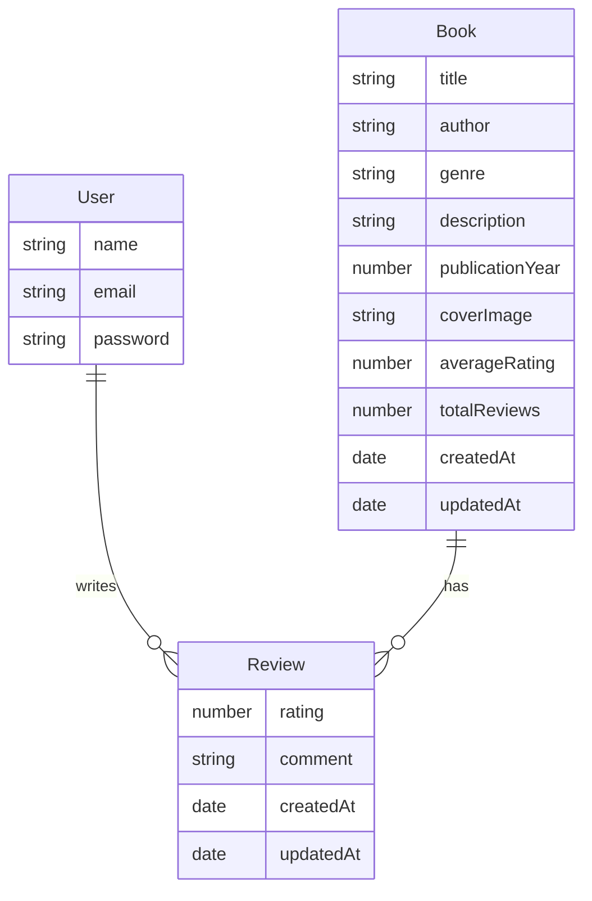

# Book Review App

A modern full-stack web application for discovering, reviewing, and managing books. Built with React (frontend), Node.js/Express/MongoDB backend).

---

## 🚀 Features

- User authentication (signup, login, JWT-based)
- Add, edit, and delete books (CRUD)
- Add, edit, and delete reviews (CRUD, only by review owner)
- Book details page with cover image, description, genre, year, and reviews
- Search and filter books by title, author, or genre
- Responsive, professional, and modern UI
- Average rating and review count for each book
- Secure API endpoints with authentication middleware

---

## 🛠️ Tech Stack

- **Frontend:** React, React Router, Context API, Axios, React Icons, Toastify
- **Backend:** Node.js, Express, JWT, bcrypt, Mongoose
- **Database:** MongoDB
- **Dev Tools:** Nodemon, Concurrently

---

## 📦 Project Structure

```
Cllg/
  backend/         # Express API & MongoDB models
    Controllers/   # Auth, Book, Review controllers
    Middlewares/   # Auth middleware & validation
    Models/        # Mongoose models
    Routes/        # API routes
    index.js       # App entry point
    seedData.js    # (Optional) Seed script
  frontend/        # React app
    src/
      pages/       # Main pages (Home, BookDetails, etc.)
      context/     # Auth context
      services/    # API service
      App.js       # App entry
      ...
  package.json     # Root: concurrent start scripts
```

---

## ⚡ Quick Start

### 1. Clone the repository

```bash
git clone <your-repo-url>
cd Cllg
```

### 2. Install dependencies

```bash
cd backend && npm install
cd ../frontend && npm install
cd ..
npm install  # for root (concurrently)
```

### 3. Set up environment variables

- Create a `.env` file in `backend/`:

```
MONGO_URI=mongodb://localhost:27017/bookreviewapp
JWT_SECRET=your_jwt_secret
```

### 4. Start the app (from project root)

```bash
npm start
```

- Frontend: http://localhost:3000
- Backend: http://localhost:8080

---

## 📝 Usage

- **Sign up** for a new account or log in.
- **Browse** or **search** for books.
- **Add** a new book (if logged in).
- **View book details**: see cover, description, and all reviews.
- **Add, edit, or delete** your own review for a book.
- **Edit or delete** books you added (if implemented).

---

## 🤝 Contributing

1. Fork the repo and create your branch: `git checkout -b feature/your-feature`
2. Commit your changes: `git commit -am 'Add new feature'`
3. Push to the branch: `git push origin feature/your-feature`
4. Open a Pull Request

---

## 📄 License

This project is licensed under the MIT License.

---

## 🙏 Acknowledgements

- [React](https://reactjs.org/)
- [Express](https://expressjs.com/)
- [MongoDB](https://www.mongodb.com/)
- [React Icons](https://react-icons.github.io/react-icons/)
- [React Toastify](https://fkhadra.github.io/react-toastify/)

---

## 🗄️ Database Schema

### User

- \_id: ObjectId
- name: String
- email: String (unique)
- password: String (hashed)

### Book

- \_id: ObjectId
- title: String
- author: String
- genre: String
- description: String
- publicationYear: Number
- coverImage: String (URL)
- averageRating: Number
- totalReviews: Number
- createdAt: Date
- updatedAt: Date

### Review

- \_id: ObjectId
- book: ObjectId (ref: Book)
- user: ObjectId (ref: User)
- rating: Number (1-5)
- comment: String
- createdAt: Date
- updatedAt: Date

### Entity Relationship Diagram


